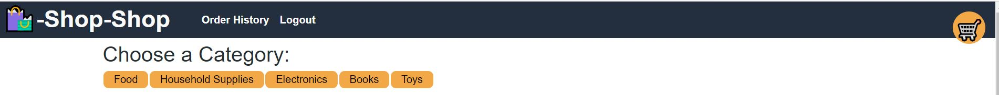
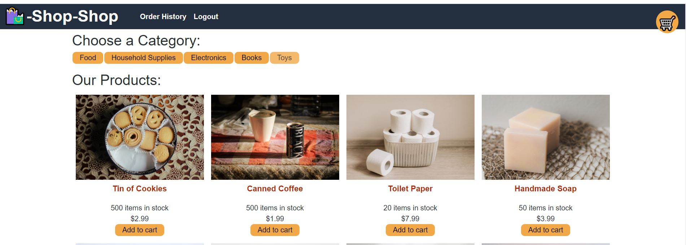
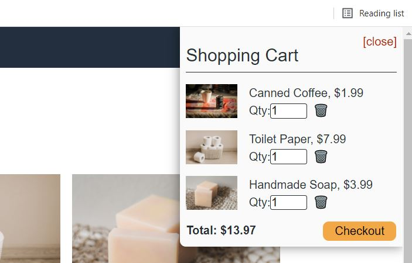

# Redux-Store 🏪




## 📝Description
```
Redux-Store is a MERN stack application that allows you to purchase products online and checkout using a third-party payment processing site. This site
used a REST based backend to handle all application routing and has been 
updated to use a GraphQL based routing solution. It has also been modified 
to use Redux for global state tracking in a store instead of a React based solution.
```

## 🧰 Technologies Used

* `Node.js`
* `npm (Node Package Manager)`
* `Javascript`
* `MongoDb Atlas`
* `Mongoose`
* `Express JS`
* `React-Redux`
* `GraphQL`
* `Bcrypt`
* `Apollo-Express`
* `Stripe`

## 🤸‍♂️Challenges/Successes


## 📸 Screenshots


> Homepage showing products you can shop for. The products can be filtered by
the category they belong to. From here, items can be added to the cart for purchase.



> The shopping cart holds all items that have been selected for purchase. You can delete or update the Qty of items in the cart. Once you decide to checkout,
the application takes you to a third party payment processing site. [Stripe](https://stripe.com/)




## 🔗 Application Links

* [Github](https://github.com/malmason/Redux-Store)
* [Heroku Deployment](https://lit-fjord-84610.herokuapp.com/)

## 📱 Contact 

Malcolm Mason - [Github](https://github.com/malmason) Email: [Malcolm](mailto:malmason66@gmail.com) 📧

---

&copy; 2021 Malcolm Mason